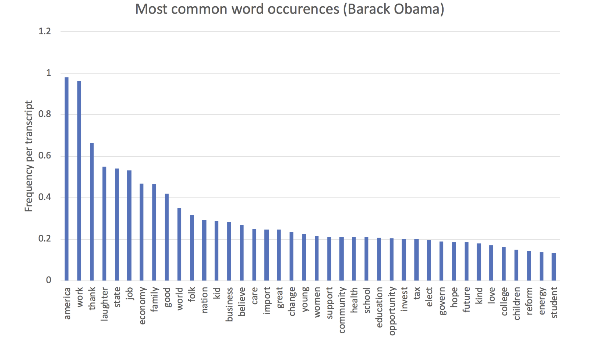

Algorithms to:

1. Scrape the White House archive for URLs to transcripts using Beautiful Soup 4
    (geturls.py)
2. Scrape the URLs to transcripts for transcript text using Beautiful Soup 4
    (webscrape.py)
3. Analye the most frequently used words from the transcript text using NLTK
    (analyse.py)

