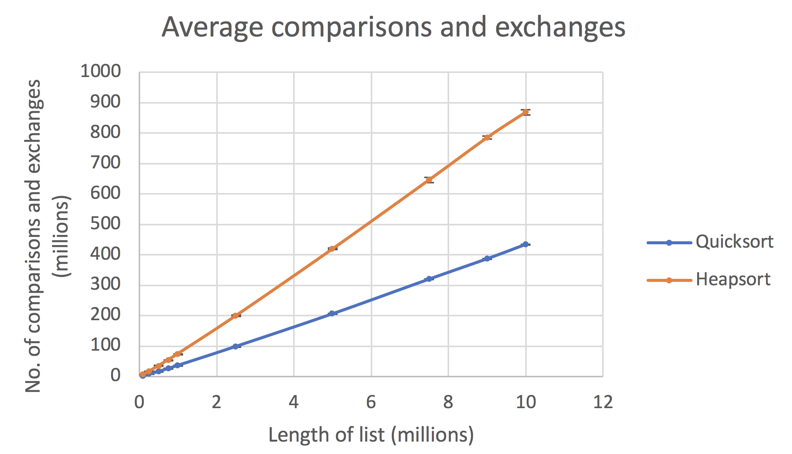
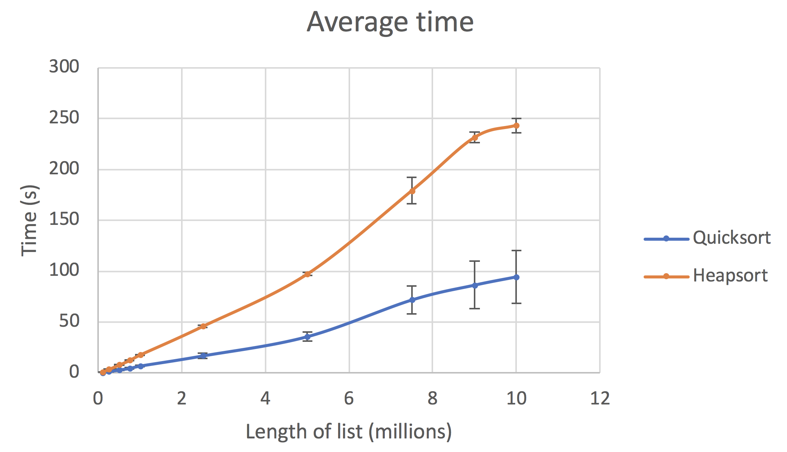
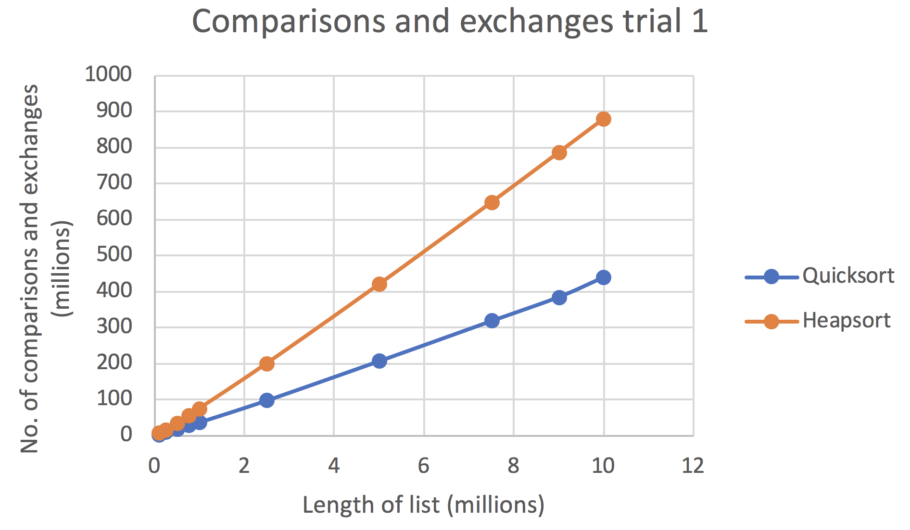
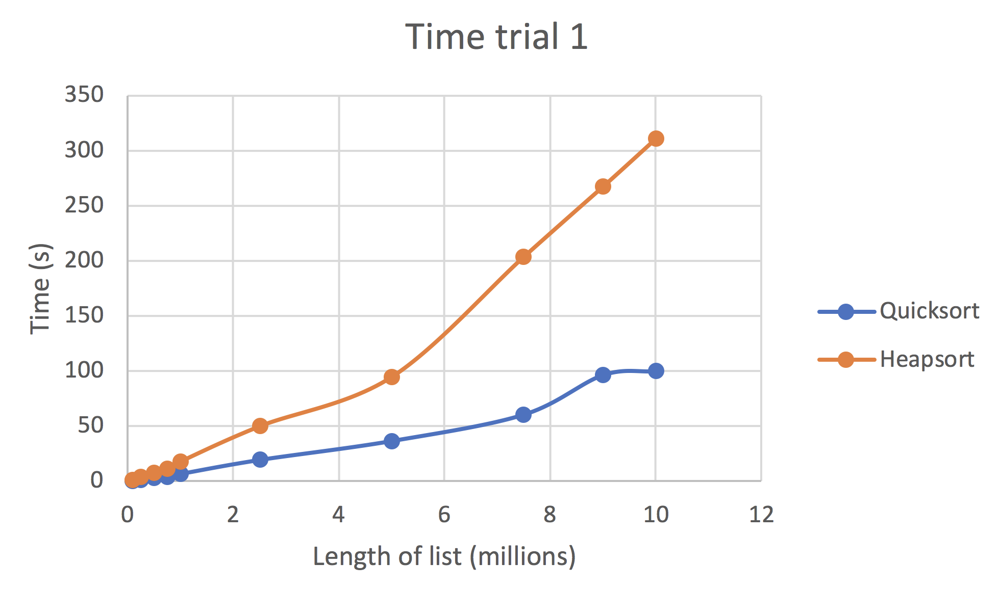
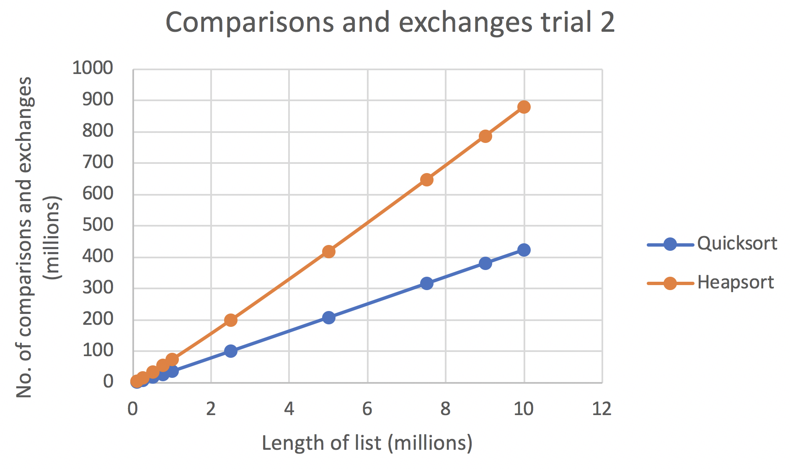
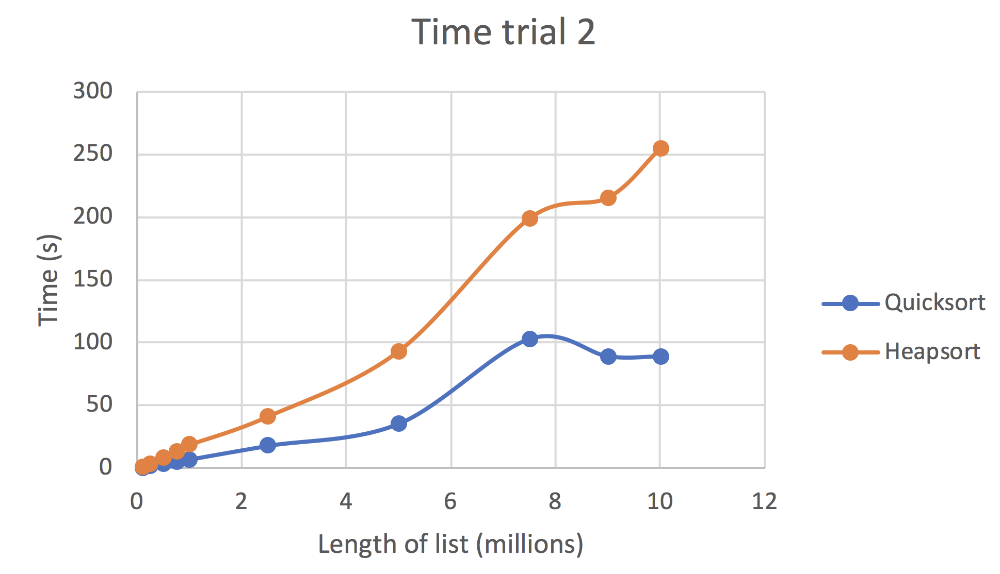
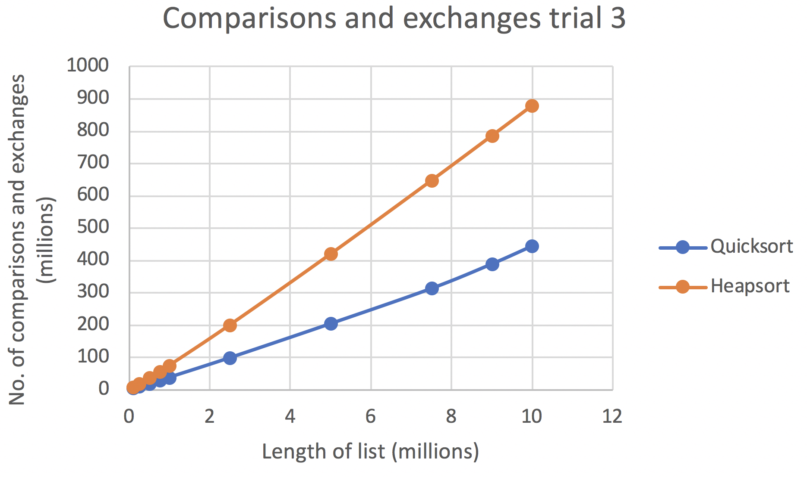
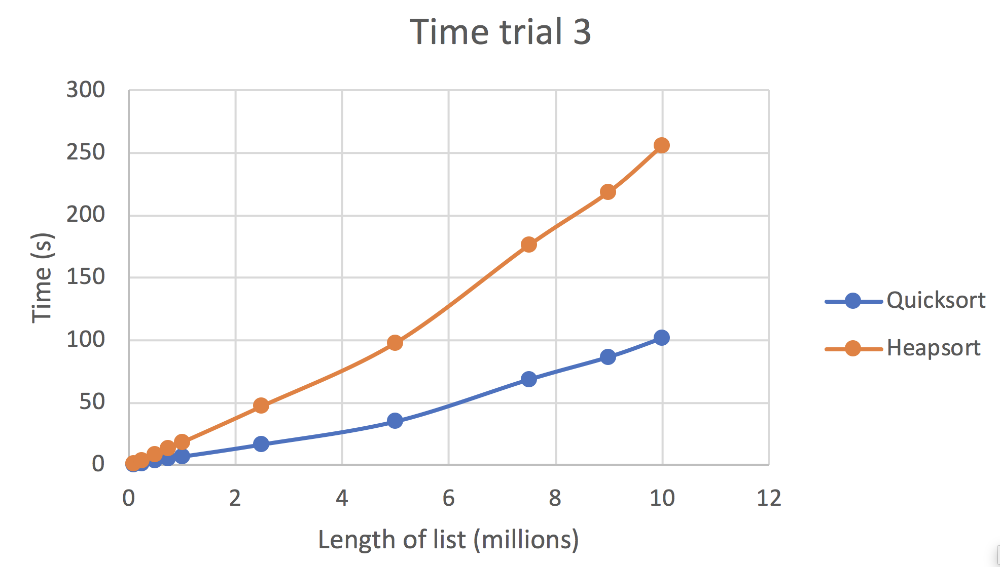

<h1>Comparing Heapsort and Quicksort</h1>

These algorithms were created to compare the time taken, no. of comparisons and no. of exchanges between quicksort and heapsort, and how they differ when the size of the list increases.

<h2>Methodology</h2>

A first algorithm [createDataSets.py](createDataSets.py) was used to create randomised lists intergers of lengths 10,000 to 10,000,000. Each time a list was created, it was stored in a txt file so that both quicksort and heapsort algorithms could read and run on the same list. 

The [heapsort](heapsort.py) and [quicksort](quicksort.py) algorithms were manipulated to have counters for no. of comparisons and number of exchanges.

The data collected was stored on a txt file ([results for heapsort](heapsortResults.txt), [results for quicksort](quicksortResults.txt)) and transferred to an [excel file](data.xlsx) to be analysed and presented.

<h2>Results</h2>

**Average of 10 trails**

**Some individual trials**

| Comparisons and Exchanges  | Time |
| ------------- | ------------- |
|   |   |
|   |   |
|   |   |

